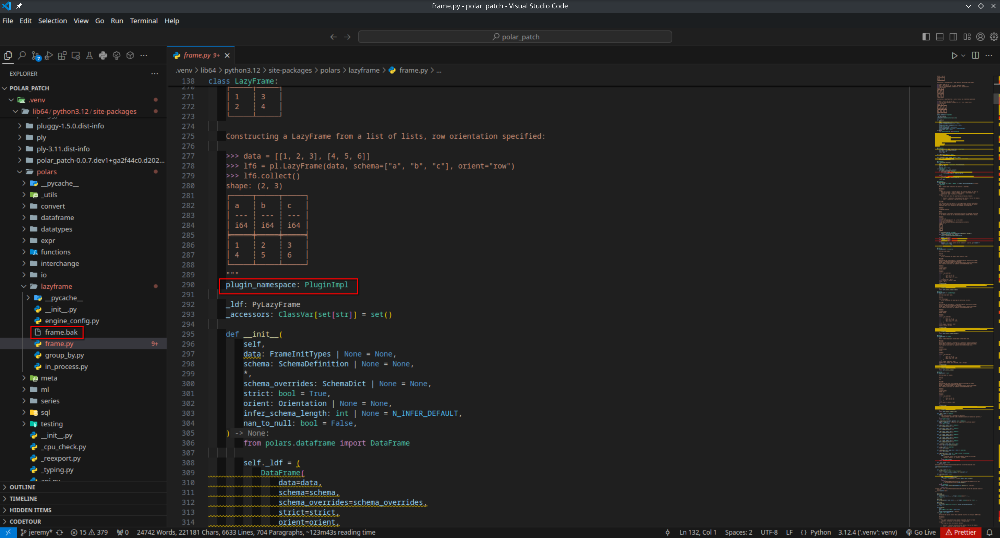
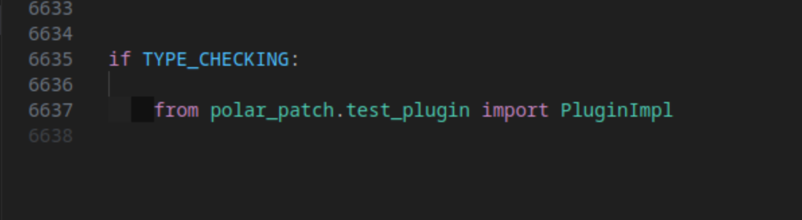

# Polar Patch

This package provides type hinting and IDE support for plugins to the Polars package, enhancing the development experience.

## Problem It Solves

Polars is a fast DataFrame library for Python, but it lacks a way to provide type hints with type checker and IDE support for custom plugins. The polars maintainers have no plans to fill this gap from within polars itself. So Summit Sailors is stepping in to help.

## Motivation

With this package, developers can:

- Write more robust and maintainable polars plugins.
- Utilize IDE Type Checker features such as autocompletion and inline documentation.
- Extend the polars ecosystem with more incentive to create new plugins

## How does it work?

1. PP parses your polar_patch.toml
2. scans files and folders you listed in ur toml
3. uses [libCST](https://libcst.readthedocs.io/en/latest/) to extract the needed info about your plugins.
4. creates a backup of the files to be modified
5. creates a copy of the backup fresh each run
6. applies the libCST transformer to add the attribute with type hint onto the corresponding Polars class
7. adds the corresponding import for your plugin into polars in a type checking block





## Notes

- It is important to note that while this is minimally invasive, it is monkey patching the executing interpreters polars package.
- libCST uses concrete syntax trees, thus the polars file is well preserved.

## Beta Blockers

- callable form of `pl.api`
- inital functional hypothesis testing setup
- basic logging
- basic exception handling
- unpin 3.12.4 to ^3.12

## Stable Blockers

- some maturity
- The blessing of the polars team for the approach on [issue](https://github.com/pola-rs/polars/issues/14475)

## Features

- automatic "hot reloading" since the type hint points directly to the implementation
- loads plugins from site-packages and generates a lockfile

## In development

- vsc extension for toml support via jsonschema

## Roadmap

- registering third party plugins in polar_patch.toml
- plugin store

## End Goal

An end-to-end framework for taking rust and/or python code into polars in python.

## Status

This package is currently in alpha and ideas are welcome. Only classes registered with the `@pl.api` decorator are currently supported. Lack of support for the callable form of `pl.api` is seen as a blocker for a beta release. Also, many edge cases have not been addressed. This is another blocker for a beta release. There is bare minimum direct testing. Thorough testing is a blocker for a stable release. only python 3.12.4 is supported atm.

## Installation

```bash
pip install polar-patch
```

## Configuration

To specify paths to be scanned for plugins, create a polar_patch.toml file in your project root.
(VSC IDE Support in Development)

```toml
[polar_patch]
scan_paths = ["path/to/your/plugin1.py", "path/to/your/polars/plugin/folder"]
```

## Usage

To use the CLI tool provided by this package, run the following command:

```bash
pp mount
```

## Undoing Changes

If you need to undo the changes made by this package, simply:

```bash
pp unmount
```

---
<a href="https://polar.sh/summitsailors/subscriptions">
  <picture>
    <source media="(prefers-color-scheme: dark)" srcset="https://polar.sh/embed/tiers.svg?org=summitsailors&darkmode"/>
    
  </picture>
</a>